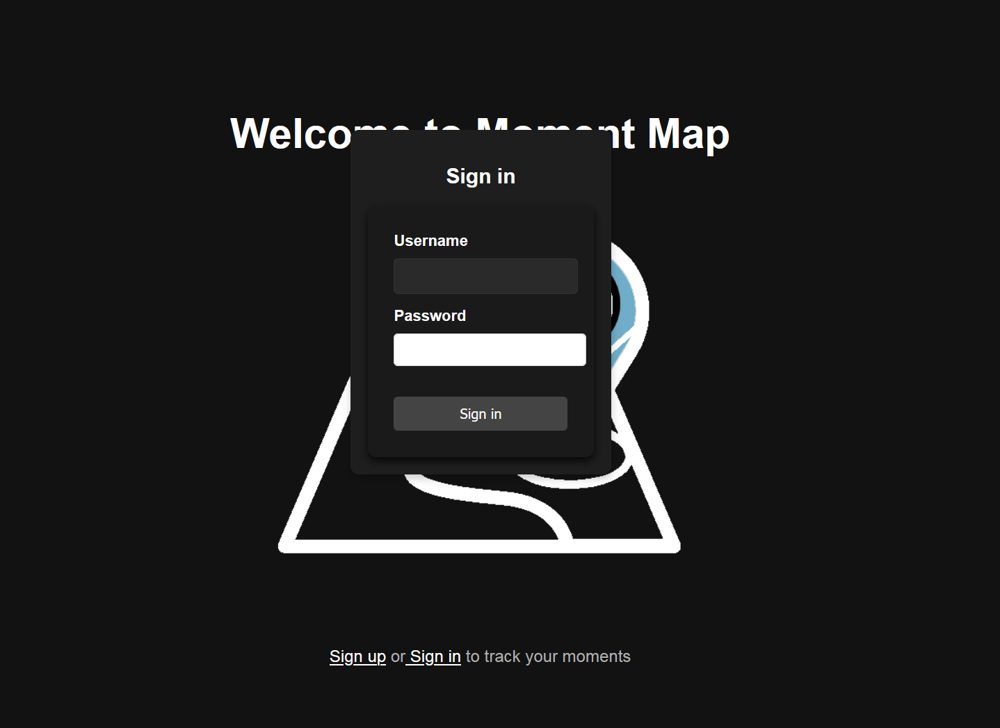
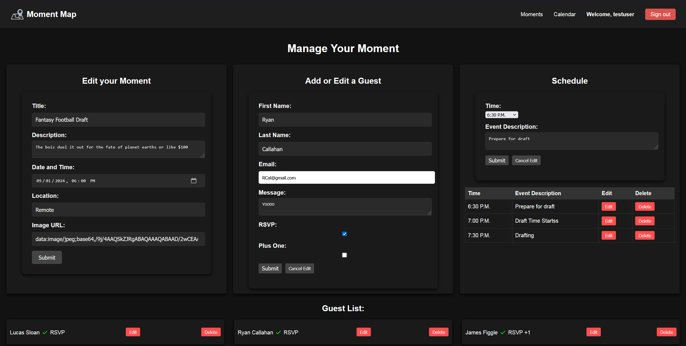

# Moment Map

  

  
  # Moment Map

  ### [Explore Now](https://your-deployed-site-url.com)
  #### [Back-end](https://github.com/Lucas-Sloan/express-api-momentmap-back-end)

  ##### Lucas Sloan

  
  

  ## :pencil: Description

 - Moment Map allows you to plan, organize, and manage your personal and group events.
 - Users can create, edit, and view events in a calendar format.
 - Features include dynamic scheduling and guest management, all in a visually appealing user interface.

  ## :mountain: Background

 - The inspiration for Moment Map came from the need to have an organized way to manage events, whether personal or professional, with a focus on tracking guest participation.
 - This project combines MongoDB, Express.js, React, and Node.js (MERN stack) with a responsive UI design.
 - The integration with Google Calendar API enhances the user experience by allowing synchronization of events with Google Calendar.

  ## :camera_flash: Screenshots 

  | Description       | Screenshot                                                |
  |:-----------------:|-----------------------------------------------------------|
  | **Landing Page**  |        |
  | **Sign Up**       |              |
  | **Sign In**       |              |
  | **Dashboard**     |          |
  | **Moments List**  |         |
  | **Moment Details**|  |
  | **Edit Moment**   |  |
  | **Calendar**      |            |

## :desktop_computer: Technologies Used

## :satellite: Future Goals

- [ ] Implement connecting to Google to send out emails with a link where guests can click on the link to RSVP themselves.
- [ ] Allow users to view and manage their profiles, with options to make them private or public.
- [ ] Enable events to be set as private or public, with corresponding access controls.

